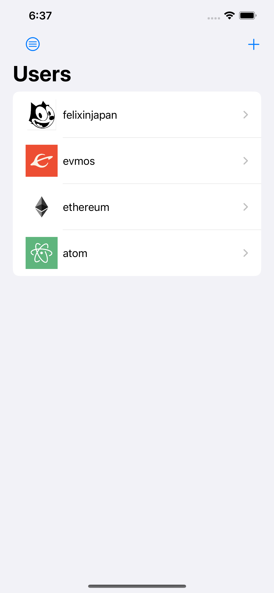
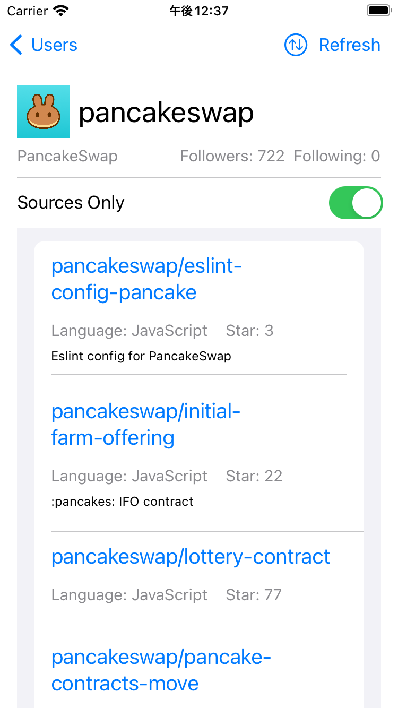
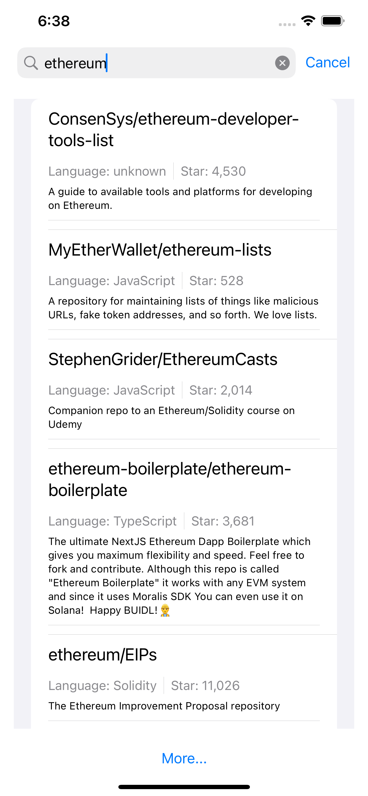

# GitBook

Github users lookup application

## Installation

Please update github token to your Personal access tokens (classic)
- GitBook/AppEnvVar/debug.xcconfig
- GitBook/AppEnvVar/release.xcconfig

Open GitBook.xcodeproj on Xcode & Run

## Environment
Xcode Version 14.0 (14A309)

iOS 16.0 Simulator and Device

swift-driver version: 1.45.2 

Apple Swift version 5.6 
## Dependency

Github API
- "/users/:owner"
- "/users/:owner/repos"
- "/search/repositories"
## Features
- [x] User list screen
    - [x] Display a list of users
    - [x] Required elements for each line
        - [x] icon image
        - [x] username
    - [x] Transition to the user repository screen by selecting each line
- [x] User repository screen
    - [x] Display user details at the top of the list
        - [x] Icon image
        - [x] User name
        - [x] Full name
        - [x] Number of followers
        - [x] Number of followers
- [x] The following lists user's repositories that are not forked repositories
    - [x] Repository name
    - [x] Development language
    - [x] Number of Stars
    - [x] Description
- [x] Tap a row in the repository list to display the URL of the repository in WebView  
- [x] Refresh Repo and User data
- [x] Refresh interval (currently 5 secs)
- [x] Display Forked and Non-Forked Only
- [x] Minimum offline support using coredata
- [x] Search Repo View
    - [x] Search based on repository name
    - [x] Support an incremental search
    - [x] Throttling by configuration in debug & release xcconfig files
        - API_SLEEP_PERIOD_SEC (Freeze API call for x seconds)
        - API_MAX_NUM_CALL (Max API call before the API call get freezed)
    - [x] Display
        - Repository name
        - Development language
        - Number of Stars
        - Description
## Note

SwiftUI + Clean architecture + MVVM

Felix Chon 
####
